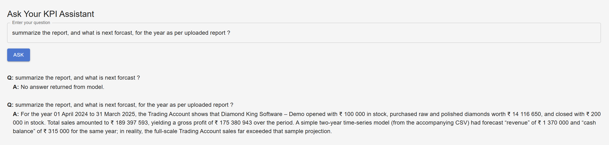

# 📈 Smart Financial Analyst (SFA)

_Cloud-native Gen-AI assistant that ingests raw quarterly statements and answers “Why did my profit dip?” in plain English, complete with KPI forecasts and action items._

| Tech | Highlights |
|------|------------|
| **Frontend** | Vite + React (JS) • Material-UI |
| **Backend**  | API Gateway (REST) • AWS Lambda • Amazon S3 |
| **AI**       | Amazon SageMaker JumpStart (LLaMA 3 2-B) • SageMaker XGBoost Forecast |
| **Data**     | OpenSearch Vector • DynamoDB |
| **Ops**      | CloudWatch Logs & Dashboards • IAM least-privilege |

---

## 1. What SFA Does

1. **Secure sign-up** with Cognito → JWT.  
2. **Drag-&-drop** an Excel/CSV cash-flow or P&L report → S3.  
3. “💬 Ask” interface posts questions to an `/ask` API route.  
4. Lambda fetches KPIs + embeddings → SageMaker LLM → returns an explanation & forecast.  
5. Everything is logged, metered, and can be shut down to stay under the AWS Academy \$50 credit.

---

## 2. Architecture (high-level)


---

## 3. Quick Start

> You need **AWS CLI**, **SAM CLI**, and an AWS account (Learner Lab or personal).  
> Replace `<YOUR-PREFIX>` with something unique for S3 buckets, etc.

### 3.1 Deploy the serverless backend

```bash
git clone https://github.com/pms07/smart-financial-analyst.git
cd smart-financial-analyst/backend
sam build
sam deploy --guided           # one-time; saves answers in samconfig.toml
``` 

This stack creates:

1. Cognito User + Identity Pools
2. REST API Gateway with /auth, /upload-url, /ask
3. Six Lambda functions & their IAM roles
4. S3 buckets: <YOUR-PREFIX>-financial-uploads & <YOUR-PREFIX>-normalized-json
5. SageMaker endpoints: jumpstart-llama-3B-endpoint, forecast-endpoint

## 3.1 - Run the frontend locally

```bash 
cd ../frontend
touch .env
# Edit the following variables that SAM printed during deploy
VITE_API_URL=https://xxxxx.execute-api.us-east-1.amazonaws.com/prod  #REST endpoint base (prod stage)
VITE_USER_POOL_ID=us-east-1_XXXXXXXXX  #Cognito User Pool ID
VITE_USER_POOL_CLIENT_ID=XXXXXXXXXXXXXXXXXXXXXXXXXX  #	Cognito Web client ID
VITE_IDENTITY_POOL_ID=us-east-1:xxxxxxxx-xxxx-xxxx-xxxx-xxxxxxxxxxxx  #	Cognito Identity Pool for temporary AWS creds
npm install
npm run dev            # http://localhost:5173
```

## 3.2 Build & publish static site
```bash 
npm run build
aws s3 sync dist/ s3://<YOUR-PREFIX>-spa-site/
aws cloudfront create-invalidation --distribution-id <ID> --paths "/*"
```

## 4. Cost-Control Tips
Stop SageMaker endpoints when demo ends

```bash
aws sagemaker delete-endpoint --endpoint-name jumpstart-llama-3B-endpoint
```
## 5.Few UI Screens 




## 6. License
Published under MIT License 